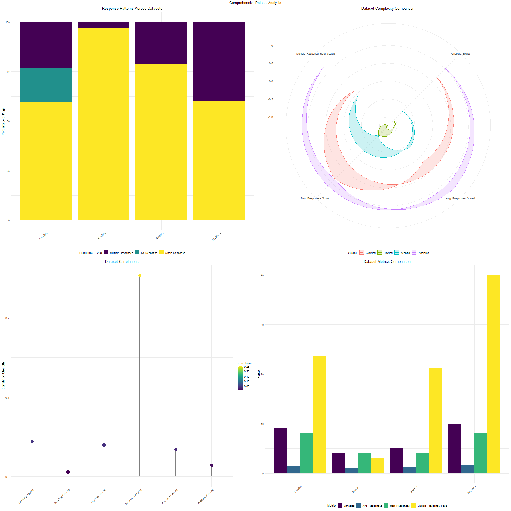
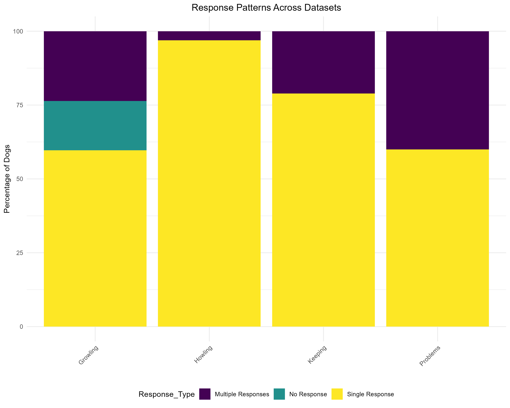
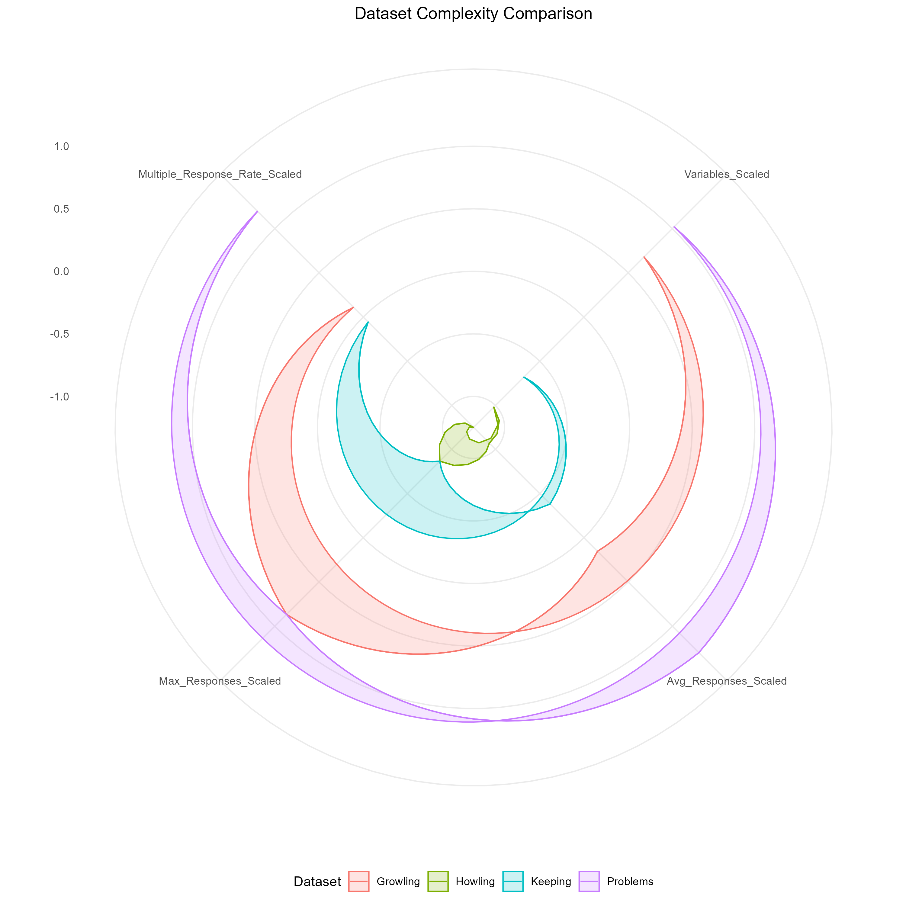
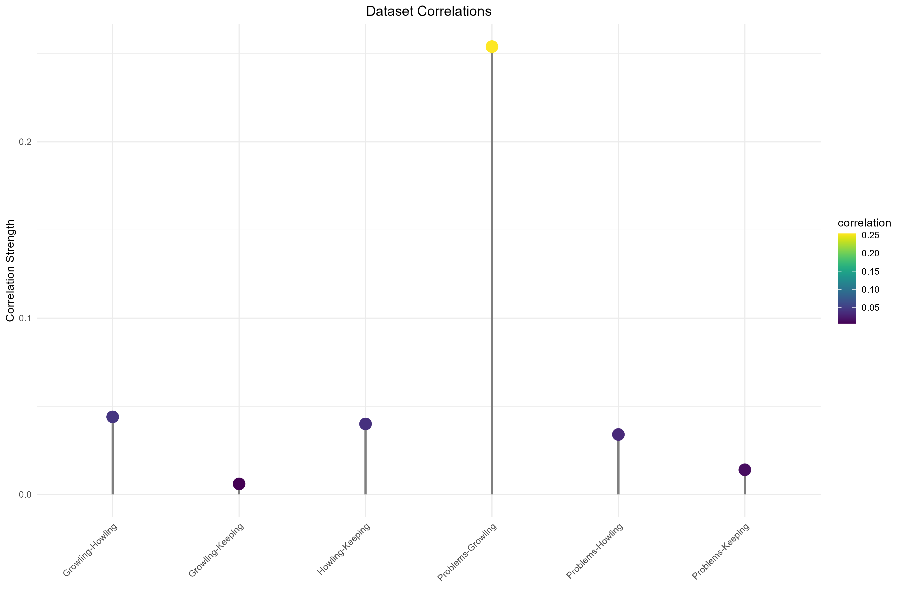
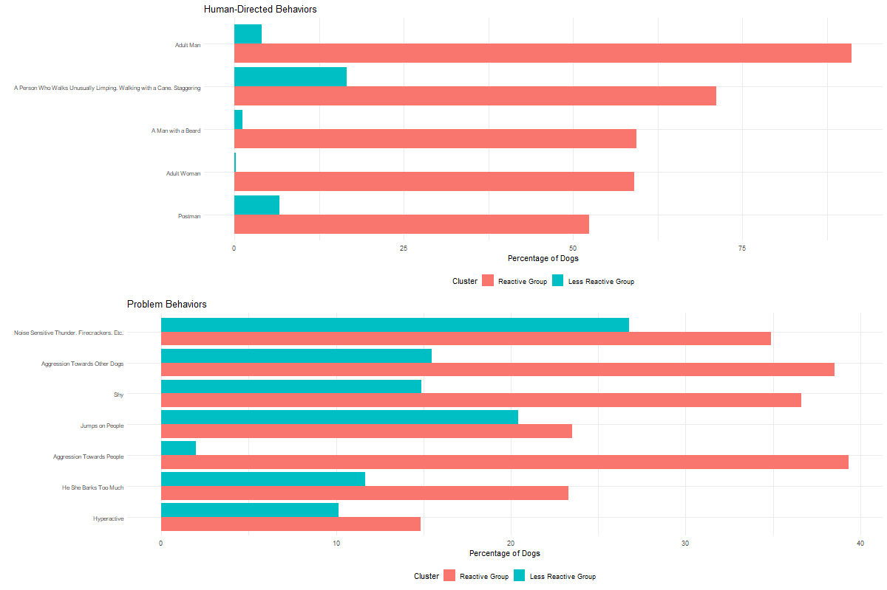
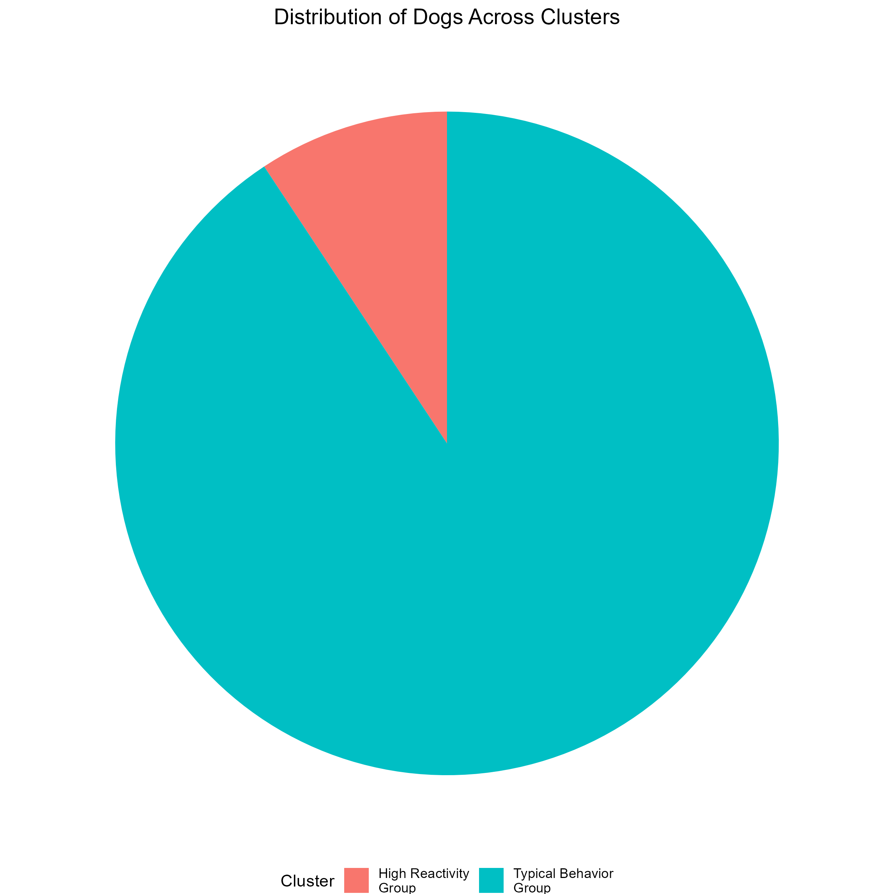
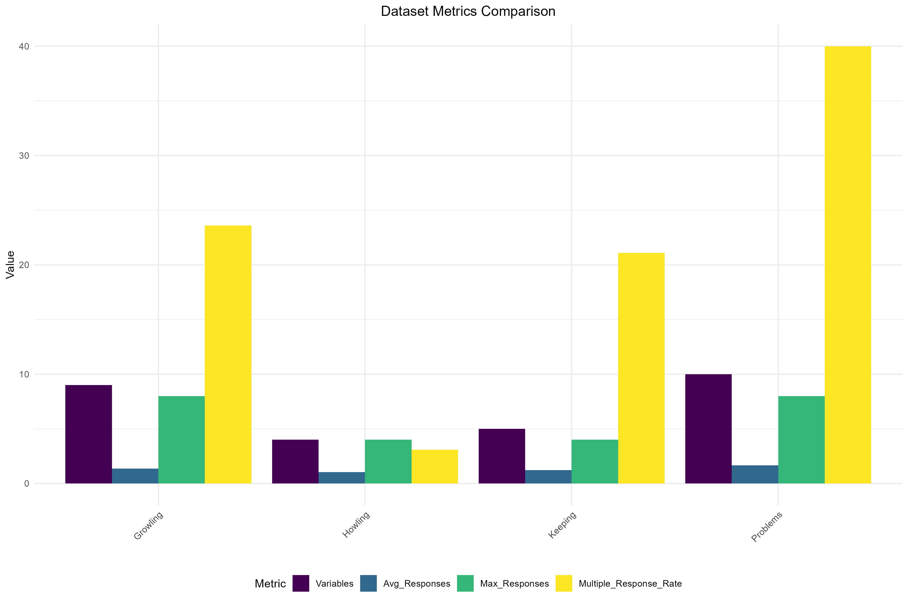

---
title: "Dog Behavioral Pattern Analysis: Comprehensive Report"
date: "`r format(Sys.time(), "%B %d, %Y")`"
output:
  html_document:
    toc: true
    toc_depth: 3
    toc_float: true
    theme: united
    highlight: tango
---

```{r setup, include=FALSE}
knitr::opts_chunk$set(echo = FALSE, warning = FALSE, message = FALSE)
```

# Executive Summary

This report presents a comprehensive analysis of dog behavioral patterns using multiple datasets and advanced clustering techniques. The analysis revealed two distinct behavioral groups and validated the importance of using multiple behavioral measures for assessment.

## Key Findings

```{r, out.width="100%"}

```

# Dataset Analysis

## Response Patterns

```{r, out.width="100%"}

```

## Dataset Complexity

```{r, out.width="100%"}

```

## Inter-Dataset Correlations

```{r, out.width="100%"}

```

# Clustering Results

## Cluster Characteristics

```{r, out.width="100%"}

```

## Cluster Distribution

```{r, out.width="100%"}

```

# Detailed Findings

```{r, results="asis"}
cat(readLines("results/dataset_relationships_summary.md"), sep = "\n")
```

# Conclusions and Recommendations

```{r, results="asis"}
cat(readLines("results/final_conclusions.md"), sep = "\n")
```

# Methodological Details

## Dataset Characteristics

```{r, out.width="100%"}

```

## Analysis Approach
- Multiple clustering methods used
- Cross-validation between datasets
- Comprehensive behavioral assessment
- Environmental context consideration

# Future Directions

1. Longitudinal Studies
2. Breed-Specific Analysis
3. Intervention Effectiveness
4. Environmental Impact Assessment


